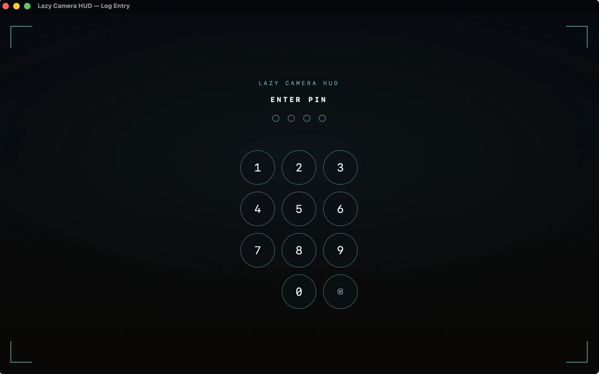
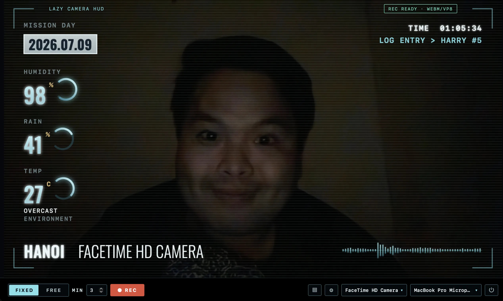
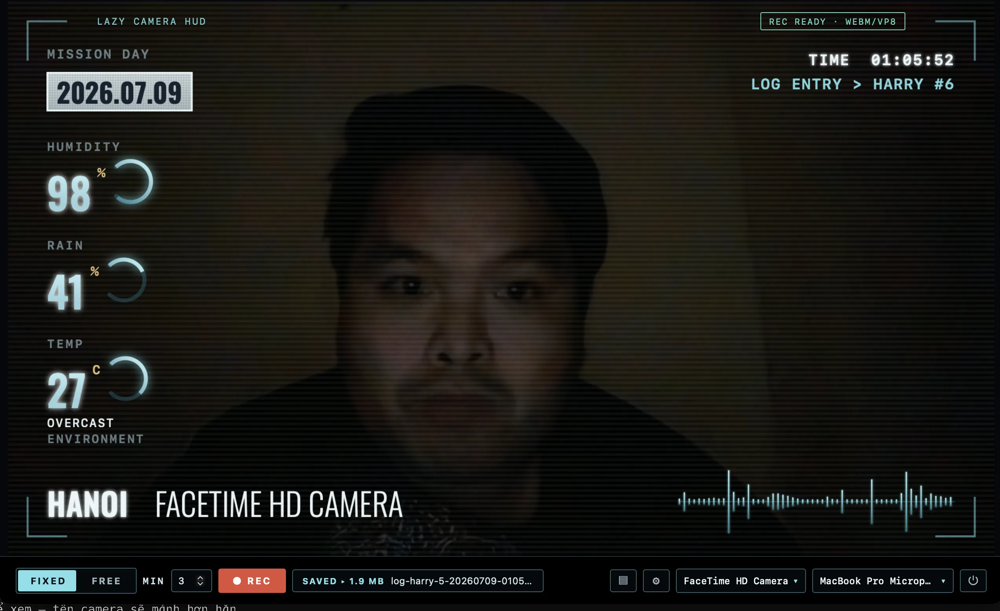
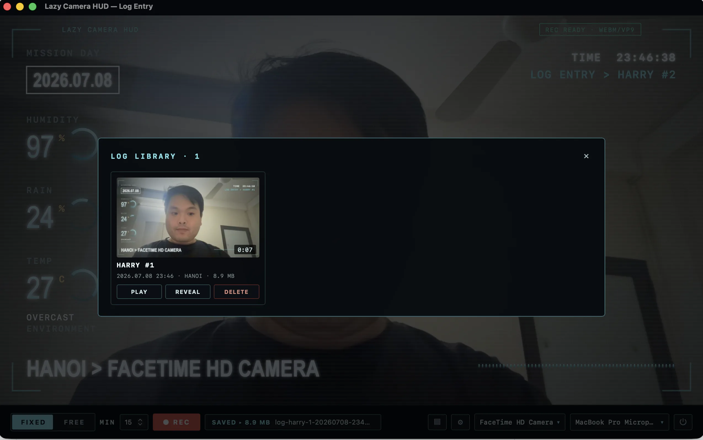
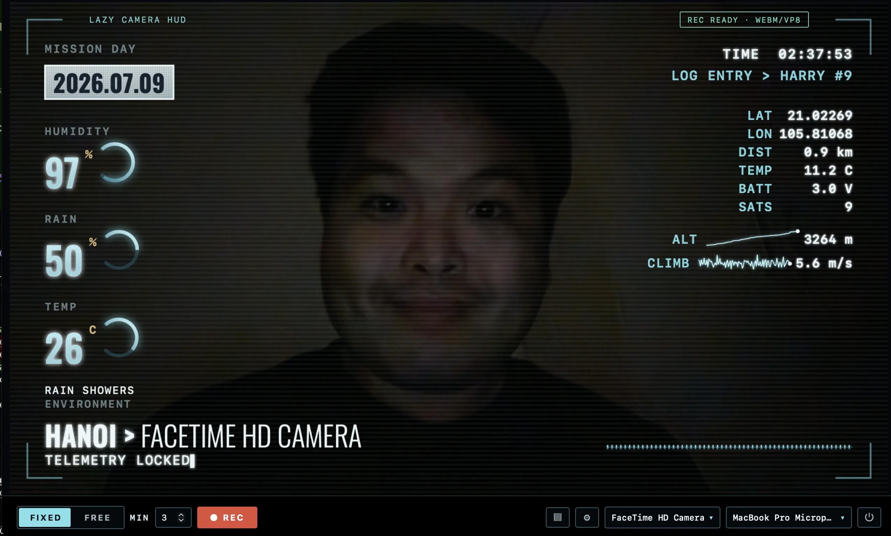

# LazyCamHUD

> 🇬🇧 [English](./README.md)

_Một cuốn nhật ký video mỗi ngày — một gương mặt, một giọng nói, một ngày tháng — được burn lớp HUD phi thuyền và truyền đi từ một nơi rất xa._

## Log entry

Có những ngày mình thấy như đang ở nơi rất xa, trôi giữa các vì sao trong một trạm nghiên cứu bỏ hoang, còn những người mình thương vẫn ở lại Trái Đất.

LazyCamHUD là cách mình ghi lại tín hiệu ấy. Mỗi đoạn clip là một bản log trong ngày, với lớp HUD kiểu bảng điều khiển tàu vũ trụ burn thẳng vào khung hình — mission day, thời tiết nơi mình đang đứng, một soundwave nhấp nhô mỗi khi mình cất tiếng. Tín hiệu nhiễu, hơi trễ, không hoàn hảo. Nhưng là thật.

Một ngày nào đó, nhiều năm sau, con gái mình sẽ mở những đoạn này ra và biết chính xác bố đã ở đâu — và rằng suốt thời gian đó, bố vẫn luôn nghĩ về con.

> Câu chuyện đằng sau: [**Tôi đang mắc kẹt ở Sao Hỏa**](https://hatrunghieu.com/posts/lazycamhud-toi-dang-mac-ket-o-sao-hoa)

Và đây — công cụ để làm ra cuốn nhật ký đó. Xây bằng **Tauri 2 + React/TypeScript**.

**Phiên bản:** 0.7.1 · **Nền tảng:** macOS + iOS/iPadOS (Apple only)

## Ảnh chụp

| Khóa PIN | Đang quay |
| --- | --- |
|  |  |
| **Xử lý → MP4** | **Thư viện log** |
|  |  |



## Nó làm được gì

- **HUD burn-in** — camera + HUD trên cùng một `<canvas>`, quay chung (không phải track overlay riêng).
- **Dữ liệu trực tiếp** — thời tiết (độ ẩm / mưa / nhiệt độ / điều kiện) + vị trí từ Open‑Meteo + IP geo; ghi đè thành phố.
- **Quay** — chế độ `FIXED` (tự dừng) / `FREE`, pause/resume, đổi camera giữa chừng với hiệu ứng mất tín hiệu. Cố định **720p/1080p**. Quay **H.264/AAC MP4 trực tiếp**; không subprocess, không transcode (iOS/macOS thống nhất, không subprocess). Dự phòng VP8 chỉ trên desktop edge case. Màn hình giữ sáng trong lúc quay (WKWebView Screen Wake Lock, iOS 16.4+ / macOS).
- **Go Live (RTMP/RTMPS)** — **chỉ macOS** — phát canvas burn-in + mic (YouTube/Facebook/Twitch) qua ffmpeg bundled, tùy chọn **lưu MP4 local song song** mà mạng lag không làm hỏng được. Chỉnh FPS/bitrate; độ phân giải stream = độ phân giải record; tự dừng khi mạng chậm kéo dài. Stream key lưu cục bộ, không log. Ẩn trên iOS.
- **Layout / Theme** — data-driven; `Martian`, `Minimal`, `Recon` × `Teal`, `Amber`, `Green`, `Crypt`. Thêm 1 cái = 1 file/entry.
- **Hiệu ứng** — lớp phủ lưới + hạt CRT, color grade điện ảnh, lật gương camera.
- **Sensor API** — đẩy readout, sparkline, caption của bạn lên HUD qua HTTP cục bộ; dropdown bind-host (localhost / LAN / custom); token bắt buộc cho network; chỉ báo API trên màn hình ([bên dưới](#sensor-api)).
- **Ship Vitals** — dải CPU/RAM/uptime (iOS + macOS) + pin (macOS only) · **Thư viện** — lưới thumbnail, player trong app, xóa · **Khóa PIN** — cổng 4 số (macOS + iOS, lưu trong OS Keychain).
- **Phím tắt** — `Space` bật/tắt quay · `1`–`4` đổi camera.

## Bắt đầu nhanh

**macOS:**
```bash
npm install
./scripts/fetch-ffmpeg.sh
npm run tauri dev                  # hoặc: npm run tauri build
```
Xuất ra `src-tauri/target/release/bundle/` (`.app` + `.dmg`).

**iOS/iPadOS:**
```bash
npm install
npm run tauri ios init             # một lần: tạo Xcode project vào src-tauri/gen/apple
npm run tauri ios dev              # hoặc: npm run tauri ios build
```
Cần Xcode, CocoaPods, rust iOS targets (`aarch64-apple-ios`, `aarch64-apple-ios-sim`), và iOS platform runtime.
Xuất ra `src-tauri/gen/apple/build/` (`.ipa` hoặc Xcode build folder cho TestFlight/App Store).

## Sensor API

Bật **Settings → API Service**, rồi đẩy text hiển thị lên HUD (burn vào video):

```bash
curl -X POST http://<host>:1337/sensors -H "Authorization: Bearer <token>" \
  -d '{"items":[{"label":"CO2","value":"812","unit":"ppm"}]}'
```

- `POST /sensors` readout · `POST /series` điểm sparkline · `POST /text` caption typewriter · `GET /healthz` kiểm tra sống.
- Settings: dropdown bind-host (localhost / LAN IP / custom), port, token. Network host **bắt buộc** token. Trên iOS, chỉ chạy foreground và tự resume khi app quay lại. Giới hạn: ≤6 item, body ≤8 KB, chỉ text hiển thị.
- Chỉ báo trên màn hình hiển thị host:port + status dot (không burn vào video).
- Thử: `node scripts/mock-sonde.mjs <token>`. Tham khảo đầy đủ: **[docs/sensor-api.md](./docs/sensor-api.md)**.

## Lưu trữ & bảo mật

**macOS:** config/entries/PIN trong Application Support, thumbnail trong Caches, video trong `~/Movies/LazyCamHUD/` (hoặc thư mục bạn chọn). Video lưu không mã hóa; PIN là **khóa UX, không phải mã hóa**.

**iOS:** config/entries/video/thumbnail trong app sandbox Documents. PIN lưu trong OS Keychain (salt + SHA-256). Video mã hóa lúc đứng yên qua NSFileProtectionComplete: khi device có passcode, file không thể truy cập khi device bị khóa.

**Cả hai nền tảng:** Không subprocess ffmpeg; quay H.264/AAC MP4 thống nhất và native. Trên iOS, mã hóa lúc đứng yên độc lập với PIN của app, hỗ trợ bởi phần cứng.

## Tài liệu

[Tổng quan](./docs/vi/project-overview.md) · [Kiến trúc](./docs/vi/system-architecture.md) · [Codebase](./docs/vi/codebase-summary.md) · [Hướng dẫn dùng](./docs/vi/usage-guide.md) · [Sensor API](./docs/sensor-api.md) · [English](./README.md)

## Công nghệ

Tauri 2 (Rust) · React 19 + TypeScript + Vite · WebKit (WKWebView) · Canvas2D HUD · Web Audio · Open‑Meteo · OS Keychain (PIN) · ffmpeg bundled (macOS only).
